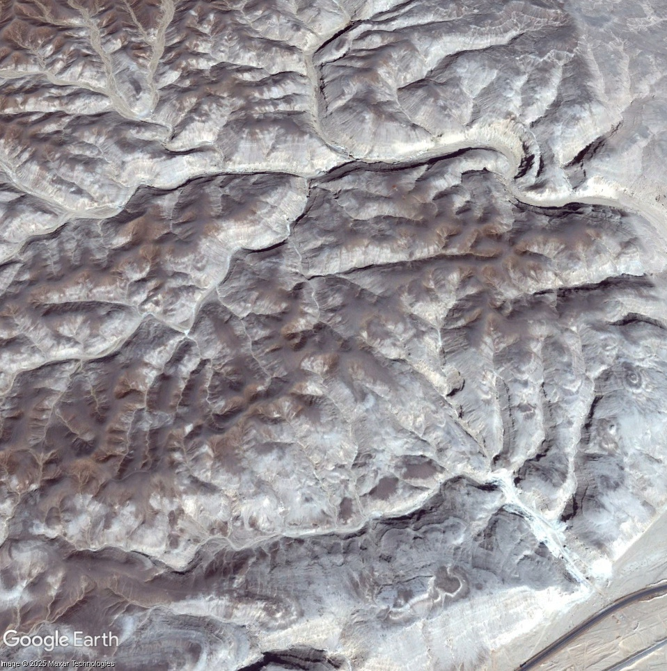

# Egyptian Archaeological Site Looting Dataset

 

## ?? Project Overview
This project focuses on identifying archaeological looting pits in Egypt using satellite imagery. Following the security vacuum of 2011, many historical sites were subjected to illegal excavations. These "pits" are clearly visible from space, and this dataset was created to provide a foundation for automated detection.

## ?? Dataset Details
The dataset consists of **230 image patches** categorized into two classes:
*   **Looted:** Image patches showing clear evidence of illegal excavation pits.
*   **Not Looted:** Image patches showing pristine terrain or natural desert features.

**Dataset Link:** [Access on Kaggle](https://www.kaggle.com/datasets/abdelazizamr837/egyptian-archaeological-site-looting)

## ?? Data Sourcing & Methodology
The images in this dataset were curated using the following process:
*   **Source:** Captured from **Google Earth Pro’s** historical imagery archive.
*   **Timeframe:** Focused on imagery from **2010 to 2016**.
*   **Locations:** Key archaeological sites including **Dashur, Lisht, and Saqqara**.

## ?? Repository Structure
\\\	ext
+-- data/
¦   +-- Looted/        # Image patches with looting pits
¦   +-- NotLooted/     # Image patches of pristine ground
+-- LICENSE            # CC BY-SA 4.0
+-- README.md
\\\

## ?? License
This project and the provided dataset are licensed under the **Creative Commons Attribution-ShareAlike 4.0 International (CC BY-SA 4.0)** License. See the [LICENSE](LICENSE) file for details.

---
**Dataset Created by:** Abdelaziz Amr
