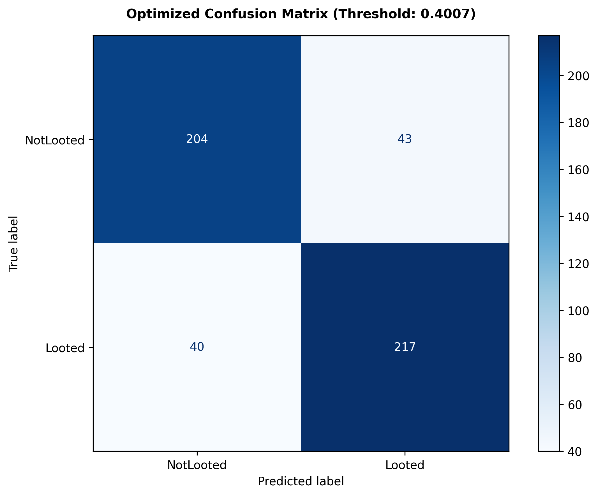

# Egyptian Archaeological Site Looting Dataset

 

##  Project Overview
Archaeological looting represents an irreversible threat to global cultural heritage. This project implements a Deep Learning classification system designed to flag looting signatures (unscientific excavation pits) across key Egyptian necropolises (Dahshur, Lisht, Saqqara, and the Eastern Desert).

Rather than using generic computer vision backbones, this system leverages a **ResNet-50** backbone pre-trained using **MoCo (Momentum Contrast)** on self-supervised remote sensing data. This ensures the model is optimized for structural and spatial patterns unique to Earth Observation imagery.

##  Dataset Details
The dataset consists of **508 image patches** categorized into two classes:
*   **Looted:** Image patches showing clear evidence of illegal excavation pits.
*   **Not Looted:** Image patches showing pristine terrain or natural desert features.

**Dataset Link:** [Access on Kaggle](https://www.kaggle.com/datasets/abdelazizamr837/egyptian-archaeological-site-looting)

## Data Sourcing & Methodology
*   **Source:** Captured from **Google Earth Pro’s** historical imagery archive.
*   **Timeframe:** Focused on imagery from **2010 to 2016**.
*   **Locations:** Key archaeological sites including **Dashur, Lisht, and Saqqara**.

---

## Model Development & Evaluation

To establish a baseline for automated detection, a classification model was developed and evaluated using out-of-fold cross-validation. The code, training notebook, and evaluation files are organized within this repository.

### Repository Structure
*   `Notebook/` — Directory containing the notebooks:
    * `egypt-looting-detector.ipynb` — The Jupyter notebook containing the training pipeline, model architecture, and threshold optimization.
*   `results/` — Directory containing the evaluation outputs:
    *   `results/confusion_matrix.png` — Visual representation of the model predictions.
    *   `results/out_of_fold_predictions_analysis.csv` — Individual image prediction probabilities and threshold analysis.

### Model Performance
The model predictions were evaluated across 504 validation samples. By applying an optimized decision threshold of **0.4007** (relative to the standard 0.50), the classification balance between false positives and false negatives was adjusted as follows:

| Metric | Value |
| :--- | :--- |
| **Accuracy** | ~83.5% (421 / 504) |
| **Precision (Looted)** | ~83.5% |
| **Recall (Looted)** | ~84.4% |
| **F1-Score (Looted)** | ~83.9% |

#### Optimized Confusion Matrix (Threshold: 0.4007)
Below is the confusion matrix generated from the out-of-fold validation results:

*   **True Negatives (NotLooted correctly identified):** 204
*   **True Positives (Looted correctly identified):** 217
*   **False Negatives (Looted missed):** 40
*   **False Positives (NotLooted flagged as Looted):** 43

The classification performance indicates that satellite imagery can be a viable signal for detecting looting pits, though there remains room for refinement (e.g., reducing false negatives to preserve site integrity).

---

## License
This project and the provided dataset are licensed under the **Creative Commons Attribution-ShareAlike 4.0 International (CC BY-SA 4.0)** License. See the [LICENSE](LICENSE) file for details.

---
**Dataset and Model Created by:** Abdelaziz Amr